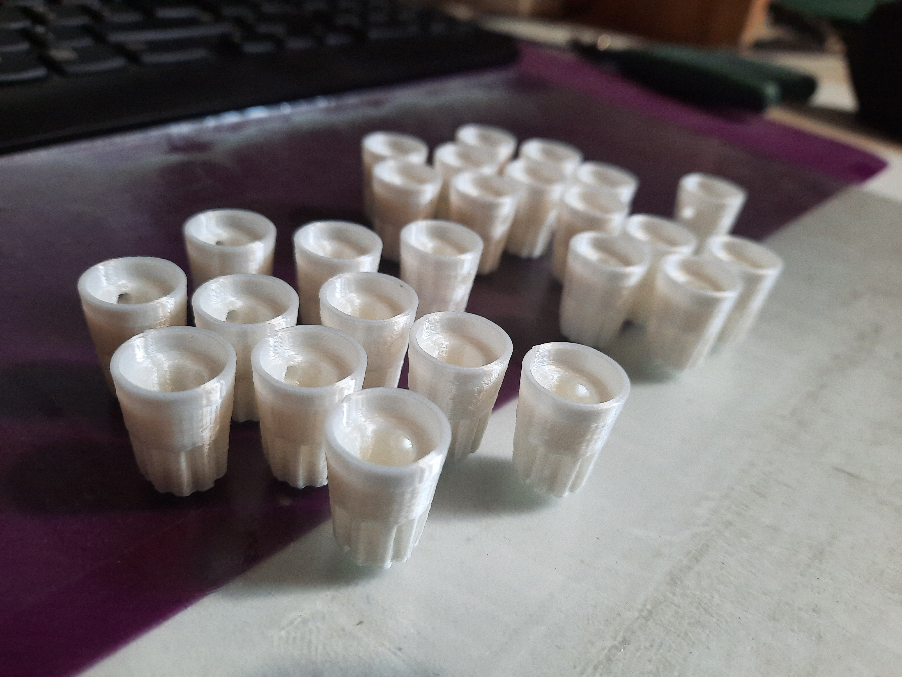

# 3d Knob Design

## Design

Freecad is a free software for 3D drawing : https://www.freecad.org/

It allowed me to draw a model that you can modify the inner diameter, the shape and the outer diameter.
You will find them in the 3D files folder.

Here a screen shot of freecad, with the final result

## Production

To obtain the knob in real life, you need to find a 3d printer.

For example in a fablab near to you. Here the file Knurled MASTER, just print with a emotion tech micro delta.

## Screw

To install the knob on your potentiometer you need a screw :

I choose this one : https://www.bricovis.fr/produit-vis-sans-tete-hexagonale-creuse-bout-cuvette-acier-14-9-zingue-blanc-din-916-sthccuvzn/#STHCCUV03/004ZN

It's : M3X4 with hexa inside

## Here the step by step knob drawing

1 - Global shape

To begin, we need to draw and dimension the overall shape of the knob.

2 - Revolution

The next step is a revolution around the y-axis

3 - Hole for nut cover

Create a cavity to hide the clamping nut

4 - Hole for the potentiometer axis

A second cavity must be created to accommodate the potentiometer stem.

5 - Knob grip

Create a groove to make the knob easier to grip

6 - circular repetition

circular repetition of the groove pattern around the knob

7 - Hole for the screw

Creating a hole for a screw to tighten the knob on the potentiometer stem

8 - Fillet

Make a fillet on the edge to soften the corners

9 - Add a mark to read the position

10 - Make a fillet to make the knob stronger on the inside

